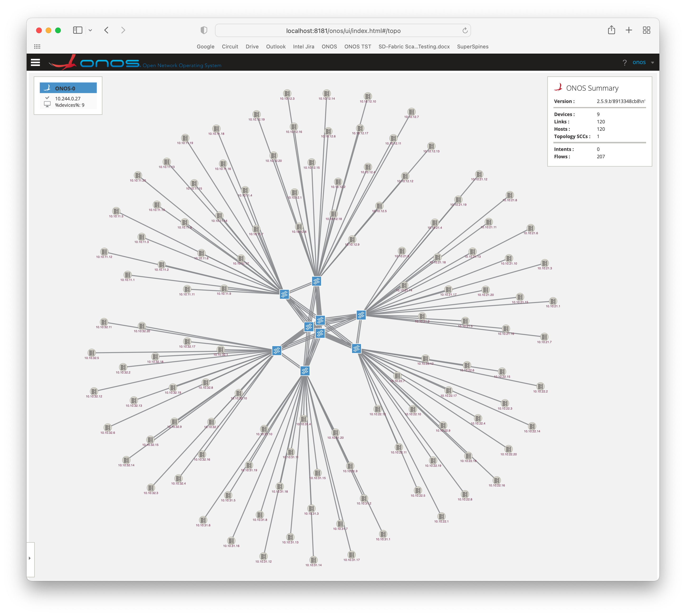
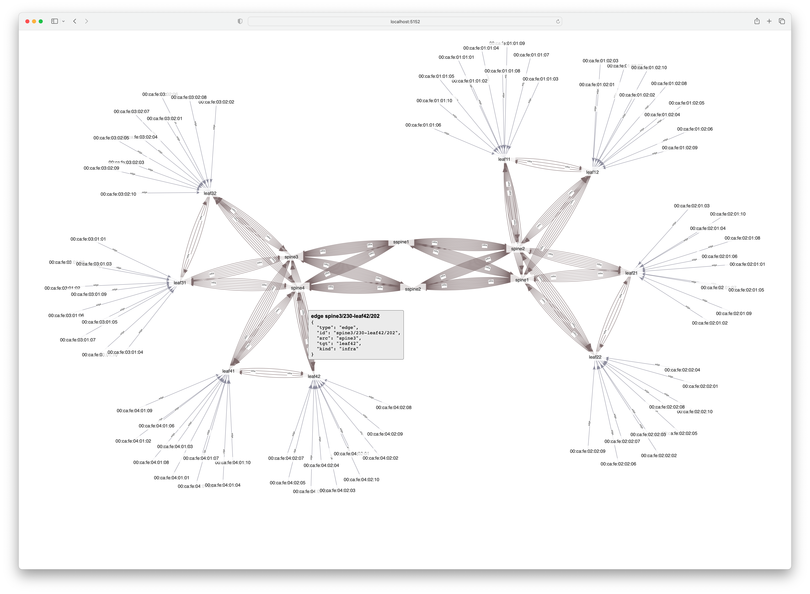

<!--
SPDX-FileCopyrightText: 2022 Intel Corporation

SPDX-License-Identifier: Apache-2.0
-->
[](https://goreportcard.com/report/github.com/onosproject/fabric-sim)
[](https://github.com/gojp/goreportcard/blob/master/LICENSE)
[](https://coveralls.io/github/onosproject/fabric-sim?branch=master)
[](https://godoc.org/github.com/onosproject/fabric-sim)

# Overview

Fabric Simulator provides simulation of a network of switches, IPUs and hosts via P4Runtime, gNMI and 
gNOI control interfaces. Controllers and applications can interact with the network
devices using the above interfaces to learn about the network devices and the
topology of the network. Note that, unlike mininet, the fabric-sim does not actually emulate
data-plane traffic. It merely emulates control interactions and mimics certain behaviours of the
data-plane. For example, if an LLDP packet-out is emitted by an application via P4Runtime,
it will result in an LLDP packet-in received by the application from the neighboring device.

The simulator can be run as a single application or a docker container. This serves as
a cost-effective means to stress-test controllers and applications at scale and a light-weight
fixture for software engineers during development and testing of their applications.

The tool is presently under active development, and contains sufficient functionality for
the simulation to be recognized by the ONOS controller as a network of Stratum Tofino devices,
as depicted in the screenshot below.



## API

In addition to the P4Runtime, gNMI and gNOI interfaces provided as part of each simulated
network device, the simulator also provides its own mezzanine [gRPC API], which can be used to add,
list and remove network devices, links and hosts into the simulation, to disable and enable
device ports, and in general to simulate a variety of events and changes in the simulated network.

The API also provides high-level insight into the simulated environment, such as number of
device table entries, counters, meters, etc. This information can be used to validate that
the controllers and applications are interacting with the network environment as expected.

In the future, this API will be extended to also include performance metrics, such as rates of
packet-outs, durations of time a device was left without a controlling entity, etc.

## Command-Line

The capabilities exposed via the simulator API can also be accessed from the ONOS command-line
(`onos-cli`) under `onos fabricsim ...` usage. For example - using the context of the `trivial.yaml`
topology, after its devices have been discovered and programmed by ONOS:
```
> onos fabricsim get devices --no-empty-info
ID               Type     Agent Port       # of Ports
switch1          SWITCH      20011          2
       Kind         ID         Size
      table   42758823            5
      table   47458892            9
      table   39601850            3
      table   40271115            4
      table   46891572            1
      meter  348262113           64
    Port ID            Port #    SDN # Speed            Name
    switch1/1               1      224 100Gbps          1
    switch1/2               2      225 10Gbps           2
switch2          SWITCH      20012          2
       Kind         ID         Size
      table   39601850            3
      table   42758823            5
      table   47458892            9
      table   40271115            4
      table   46891572            1
      meter  348262113           64
    Port ID            Port #    SDN # Speed            Name
    switch2/1               1      234 100Gbps          1
    switch2/2               2      235 10Gbps           2
```


## fabric-sim-topo tool

In addition to the `onos-cli`, a number of special-purpose tools, not available via the simulator
API are provided via the `fabric-sim-topo` tool, which is bundled into the fabric-sim docker container.

### Loading topologies via YAML files

Topologies can be described via a YAML file and then loaded into the running simulator using the
`fabric-sim-topo load ...` command.

A topology YAML file provides the following information:

* Devices and their ports
* Links, defined in terms of their device port end-points
* Hosts and their network interfaces to allow expressing multi-homed end-stations

Some sample topology files are provided in the [topologies] folder.

### Generating large topologies

In order to avoid the manual effort for creating the raw topology YAML files, several options
are available to generate large topologies from simple and parametrizable recipes via the 
`fabric-sim-topo generate topology ...` usage:

* `access_fabric` - robust leaf-spine fabric with customizable number of spines and paired leafs
* `superspine_fabric` - leaf-spine-superspine fabric designed from 32-port switches

Other recipes can be easily added to the tool which allows a YAML recipe file consisting of a few
lines to be used for generating large topology files consisting of hundreds, if not thousands, of
lines. Such files would be costly to produce and to maintain, if created by hand.

Sample recipe files, and the derived topology files, are available in the [topologies] folder and 
can be easily reprocesed via `make recipes` command.

### Generating ONOS netcfg files

To simplify integration of the simulator with the ONOS controller, the tool also provides
means to generate a `netcfg.json` file from a topology YAML file, via 
`fabric-sim-topo generate netcfg ...` usage. The resulting JSON file can be uploaded
to ONOS via its REST API to specify how ONOS can connect to the simulated environment.

Pre-generated, ready-to-use netcfg files are available for each topology file in the
[topologies] folder and can be easily regenerated using the `make necfg` command.

## Helm Chart
As mentioned above, the fabric simulator is available as a docker image, which also
contains the `fabric-sim-topo` tool. To simplify its deployment under Kubernetes, 
the [simulator helm chart] is made available under the main ONOS helm charts repository.

## Integration Tests
A number of integration tests are available for the simulator, built atop the [helmit] test framework.
To execute them, simply run `make integration-tests` command.

### LiteONOS Controller
One of the integration test suites (`onoslite`) aims to mimic the type of interactions that the ONOS controller
has with the network environment in order to discover and control it. To that end, it implements an
ultralight controller, dubbed `LiteONOS` which can be used to test the fabric simulator functionality
as part of the Helmit integration tests.

The `LiteONOS` controller establishes connection with each simulated device, and uses the P4Runtime interface
to do the following:
* establish mastership for the default role
* reconcile the forwarding pipeline configuration
* install flows to punt LLDP and ARP ether-type traffic to the controller
* monitor packet-in messages for LLDP and ARP packets for link and host discovery, respectively
* emit LLDP packet-out messages for link discovery

It also uses the gNMI interface of each simulated device to discover ports and their state, and gNOI
System.Time service as device liveness/availability probe.

The `LiteONOS` controller itself does not perform any assertions - it is pure Golang code - but the
tests in the suite that ignite the controller and load the fabric sim using several topologies, 
indeed do perform assertions to make sure that the controller managed to discover all devices, their ports, 
links, and all the hosts.

### LiteONOS GUI
To aid in troubleshooting and debugging, the `LiteONOS` controller provides a simple web-based GUI
that displays the devices, links, and hosts in a force-layout graph in a browser. To access this GUI,
one must establish port-forwarding for port `5152` from the helmit kubernetes pod that executes the tests
(matching `-onoslite-` regex) and point their browser at `http://localhost:5152`. The following screenshot
demonstrates what the view will look like for the `superspine.yaml` topology test.



[topologies]: topologies

[gRPC API]: https://github.com/onosproject/onos-api/tree/master/proto/onos/fabricsim

[simulator helm chart]: https://github.com/onosproject/onos-helm-charts/tree/master/fabric-sim

[helmit]: https://github.com/onosproject/helmit
